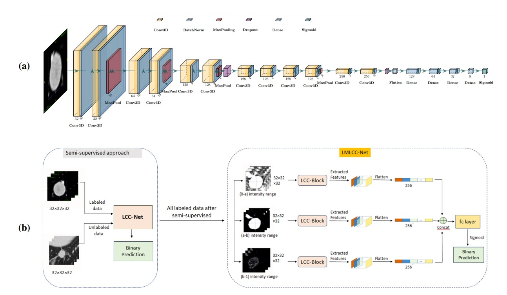

# LMLCC-Net_Lung_Cancer_Classification

Lung cancer is the largest cause of patient mortality all around the world. Deaths can be prevented if pulmonary nodules can be identified in an early stage as cancerous. Many deep learning models have been employed to classify these nodules as benign and malignant. In this work, we used novel approaches to classify the nodules using 3D CNN. Firstly, we used a different criteria to label the ambiguous instances in the dataset. We used Semisupervised method to increase the training set. Secondly, we used a lightweight deep learning model to classify the nodules. Finally, the key aspect of this work is the inclusion of intensity as a learning parameter, as the benign and malignant nodules have significant differences in intensity pattern distribution. This study considers the intensity pattern as well as textural patterns. Intensity patterns were extracted by dividing the images into multiple branches. Various combinations of branches, and learnable ranges of filters were explored to finally yield the best performing model. The experiments are carried out on the LUNA16 dataset. The classification accuracy (ACC) is **91.96%**, specificity(SPE) is **92.04%** and area under the curve (AUC) is **91.87%** . The results show that the included novelties increase the classification accuracy. This proposed method can be advantageous to classify benign and malignant nodules and can assist radiologists in pulmonary nodule classification.

## Dataset:

We used [LUNA16 dataset(Lung Nodule Analysis 2016)](https://luna16.grand-challenge.org/Data/), which is a subset of the [LIDC-IDRI dataset](https://wiki.cancerimagingarchive.net/pages/viewpage.action?pageId=1966254). It consists of thoracic CT scans along with annotations provided by multiple radiologists. It contains 1018 low dose CT images.  The LUNA16 dataset removes the CT scans with a slice thickness greater than 2.5 mm. Thicker slices can reduce image resolution and make it difficult to accurately identify and measure small nodules. Nodules that are 3 mm or larger and are accepted by at least three out of four radiologists are included in the reference standard. So, nodules smaller than 3 mm, or annotated by only one or two radiologists are excluded. Finally, 888 low dose CT images are generated.

## LMLCC-Net:

